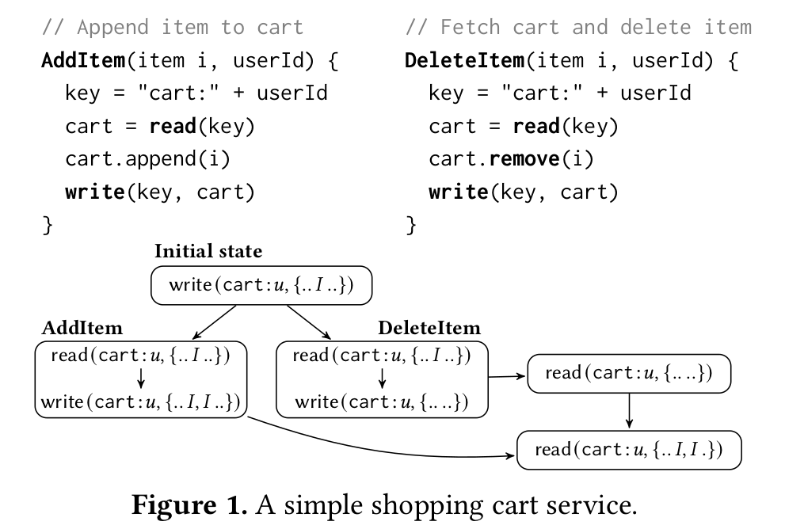

# Weak Isolation Mock DB Proposal

Hello team,

This write-up is a proposal for addition of a new state store to Dapr. Weak-Isolatation-Mock-DB ([Github](https://github.com/microsoft/weak-isolation-mock-db)) can be used to systematically test application against weak behaviors of databases. In practice, real world databases rarely generate weaker behaviors which makes it very difficult for application developers to test all possible worst-case scenarios and can lead to bugs going unnoticed. Weak-Isolatation-Mock-DB with Dapr can be used by developers as a pluggable replacement for existing state store to throughly test their applications with weaker behaviors.


Dapr currently supports only two consistency levels: eventual and strong consistency, based on quorum configuration.  When using eventual consistency, the store only waits for only one replica. In theory, this could lead to store returning stale data, but in practice most of the state stores perform well even with eventual consistency. 

In the below experiment, we tested what it takes to break existing Dapr applications with a Dapr-supported state store.

### Applications

#### Hello World [[Github](https://github.com/dapr/quickstarts/tree/master/hello-world)]

This is a simple hello world application to which we added an additional check for read-your-writes consistency. We use Cassandra as a state store and show that even with such a simple application, it is possible to violate read-your-writes consistency. See appendix for details on how to reproduce this violation.


#### Dapr-Store [[Github](https://github.com/benc-uk/dapr-store)]

This is a shopping store application built using Dapr. As with any other shopping cart application, there are few anomalies which exist with this application. A well-known anomaly is that of reappearing of a deleted item. The figure below shows the anomaly. 





Consider the case when a user is accessing cart from multiple clients, deleting and adding an item simultaneously. This might lead to the user observing delete being successful in the first read, but in the next read, the deleted item might reappear in the cart. This anomaly is difficult to reproduce with real world databases, we confirmed this by running it with Redis and Cassandra state stores and did not observe any violation within reasonable amount of time. However, this anomaly can be reproduced using the modified Cassandra setup as that of the above application. The problem with this approach is that it's very specific to the state store and can not be easily scaled to a large real-world application which use multiple state stores.


We used Weak-Isolatation-Mock-DB as a Dapr state store and were able to reproduce the violation within ~20 iterations (< 2 seconds). 

##### Fixing Shopping Cart Anomaly

Once the application developer knows that a violation exist, they have to fix the application. The item reappearing anomaly can be fixed in multiple ways, we describe one possible solution below:

* Use ETags to read and write - In case of concurrent writes within a replica, only one write should go through
* ETags alone is not sufficient to solve the issue, the writes done by the AddItem and DeleteItem have to be strongly consistent. Therefore either add happen before delete or vice versa, in all the replicas together.

We implemented the above solution and then did not observe any violation with Weak-Isolatation-Mock-DB.

### Appendix 

##### Steps to reproduce consistency violation with Cassandra 

1. Set up Cassandra cluster using https://github.com/riptano/ccm

```bash
ccm create test -v 2.2.18 -n 3 -s # create a new test cluster with 3 nodes
ccm node1 cqlsh # login to node1 cqlsh
```

```cassandra
cqlsh> CREATE KEYSPACE dapr WITH REPLICATION = {'class' : 'SimpleStrategy', 'replication_factor' : 3};
cqlsh> use dapr;
cqlsh> CREATE TABLE items (key text PRIMARY KEY, value blob);
```

2. Create cassandra.yaml for Dapr and place it in Dapr config folder (~/.dapr/components/)

   ```yaml
   apiVersion: dapr.io/v1alpha1
   kind: Component
   metadata:
     name: statestore
   spec:
     type: state.cassandra
     metadata:
     - name: hosts
       value: 127.0.0.1,127.0.0.2,127.0.0.3
     - name: consistency
       value: "One"
     - name: replicationFactor
       value: "3"
   ```

   

3. Add rule to partition nodes

   The following rules will drop all outgoing messages to all the three replicas (see https://thelastpickle.com/blog/2015/10/12/partitioning-cassandra-for-fun-and-timeouts.html for more systematic way to do it)

```bash
sudo iptables -A INPUT -p tcp --destination localhost --destination-port 7000 -j DROP
sudo iptables -A INPUT -p tcp --destination 127.0.0.2 --destination-port 7000 -j DROP
sudo iptables -A INPUT -p tcp --destination 127.0.0.3 --destination-port 7000 -j DROP
```

3. Run hello world Dapr app

```bash
dapr run --app-id nodeapp --app-port 3000 --dapr-http-port 3500 node app.js
dapr run --app-id pythonapp python3 app.py
```

